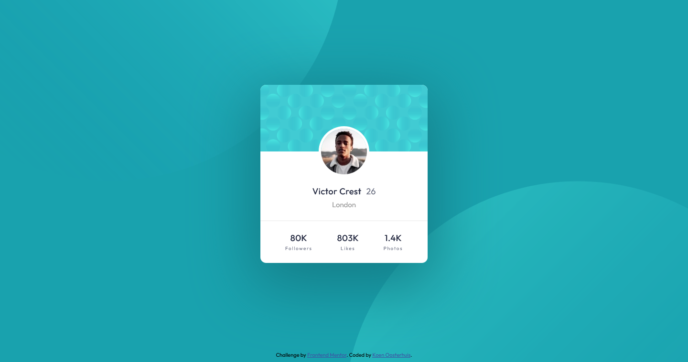

# Frontend Mentor - Profile card component solution

This is a solution to the [Profile card component challenge on Frontend Mentor](https://www.frontendmentor.io/challenges/profile-card-component-cfArpWshJ). Frontend Mentor challenges help you improve your coding skills by building realistic projects. 

## Table of contents

- [Overview](#overview)
  - [The challenge](#the-challenge)
  - [Screenshot](#screenshot)
  - [Links](#links)
- [My process](#my-process)
  - [Built with](#built-with)
  - [What I learned](#what-i-learned)
  - [Continued development](#continued-development)
  - [Useful resources](#useful-resources)
- [Author](#author)
- [Acknowledgments](#acknowledgments)

**Note: Delete this note and update the table of contents based on what sections you keep.**

## Overview

### The challenge

- Build out the project to the designs provided

### Screenshot

### Links

- Solution URL: [Link](https://github.com/koeno100/profile-card-component)
- Live Site URL: [Link](https://koeno100.github.io/profile-card-component/)

## My process

### Built with

- Semantic HTML5 markup
- Flexbox

### What I learned

In this exercise, what I especially learnt is how to set up a coherent layout using semantic HTML. On top of that, styling the design was challenging since it involved some backgrounds, images that were shifted in position and the circles in the background. What I also did now was exclusively using `rem` instead of `px` to get a fully responsive design that would react to any set font by the user.

### Continued development

I want to continue improving my semantic HTML, flexbox and responsiveness skills. I also want to start focusing more on accessibility.

### Useful resources

- [Why you should never use px to set font-size in CSS](https://joshcollinsworth.com/blog/never-use-px-for-font-size) - Someone linked me to this article on why to use `rem` instead of `px`. Very clear and informative read!

## Author

- Frontend Mentor - [@yourusername](https://www.frontendmentor.io/profile/yourusername)

## Acknowledgments

Especially helpful for this project was [Grace Snow's'](https://www.frontendmentor.io/profile/grace-snow) solution to set the background images. Check it out [here](https://www.frontendmentor.io/solutions/profile-card-with-pseudo-backgrounds-and-accessible-list-577BPZiIm)!
